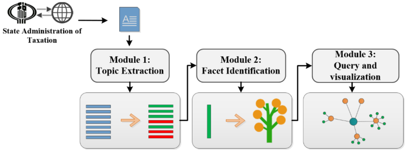
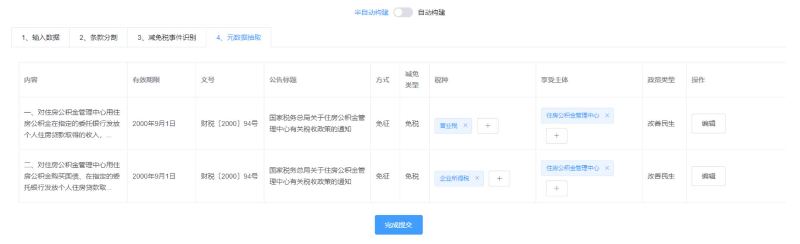
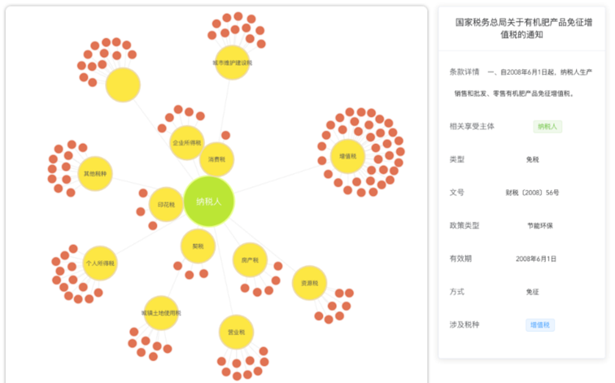

# 税收优惠法规可视化分析前端仓库

## 工作简介
设计开发了一个使用简单、操作便捷的税收优惠法规可视化分析系统。该系统设计了税收优惠关键要素数据模板，定义了税收优惠主题和税收优惠分面，并实现主题和分面的识别和抽取工作，完成了非结构化的税收优惠政策到结构化的税收优惠关键要素数据模板的转换。特别是根据税收优惠关键要素数据模板，设计了相关的重要信息抽取算法，研究开发了税收优惠法规可视化分析与查询功能；并且，该系统的自动抽取功能可以经过人工干预，进行数据修正调优，之后存储的数据可以作为该系统的训练集再次训练，形成一个不断迭代优化的过程，可以使得系统的识别与处理精度再度提升。

税收优惠法规可视化分析架构



税法分割


分面识别


识别修改



可视化查询



### 运行

克隆到本地

```
npm run dev
```

### 构建

```
npm run  build
```


